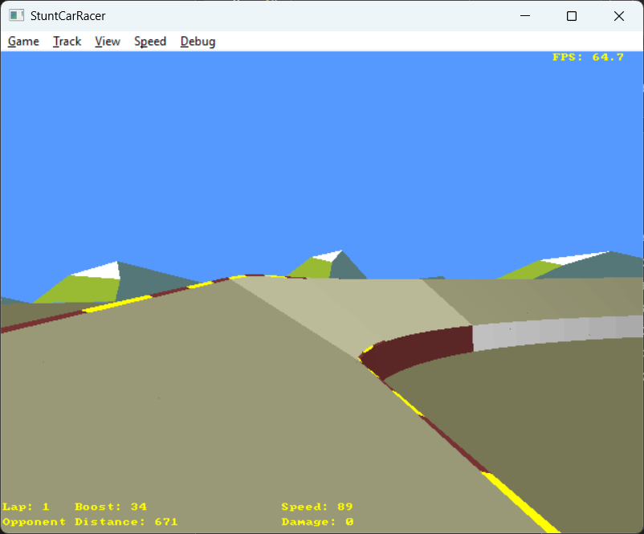

Stunt Car Racer game

[](https://github.com/ZacWalk/stuntcarracer/actions/workflows/build.yml)

I used to love this game when I was a kid.

## Screenshot



## About

Stunt Car Racer (published as *Stunt Track Racer* in the US) is a racing game
designed by Geoff Crammond and published in 1989 by MicroProse under their
MicroStyle and MicroPlay labels. Original versions were released for the Amiga,
Atari ST, Commodore 64, MS-DOS and ZX Spectrum, with an Amstrad CPC port
following in 1990. Two players race head-to-head on an elevated track, with
ramps that must be driven off correctly forming the main obstacle. The game was
released to critical acclaim — the Commodore 64 version's use of 3D vector
graphics drew particular praise, which was unusual for that platform at the
time.

This project is a Windows C++ port based on
[stuntcarremake](http://sourceforge.net/projects/stuntcarremake/) from
SourceForge.

## Rendering

This version uses an entirely **software 3D renderer** — no Direct3D, OpenGL or
GPU acceleration. The pixels presented to the window are produced by code in
[src/render.software.cpp](src/render.software.cpp). Notable algorithms:

- 4×4 row-major matrix pipeline (world / view / perspective projection)
- Homogeneous clip-space near-plane triangle clipping (Sutherland–Hodgman style)
- Edge-function triangle rasterizer with perspective-correct attribute
  interpolation via 1/w
- Z-buffer depth testing
- Backface culling (clockwise / counter-clockwise / none)
- Per-face flat shading with a single directional light (Lambertian diffuse +
  ambient)
- Affine 2D primitives for HUD, text and screen-space fans

The final RGBA framebuffer is blitted straight to the window by the platform
layer's `present_pixels`, outside any paint handler, so the game keeps full
control of its frame loop. Audio is XAudio2, reached through `pf::sound_buffer`.

## Building

You need **Visual Studio** (with the Desktop C++ workload installed). From an
x64 Developer PowerShell:

```
.\dd.ps1 build
```

or drive CMake directly with `cmake --preset release && cmake --build --preset release`.
The output `exe\stunt-car-racer-64.exe` is a single EXE — all game data (tracks,
sounds and textures) is compiled into it. The platform layer comes from the
separate [platform-h](https://github.com/ZacWalk/platform-h) repository via
`FetchContent`; a sibling `../platform-h` checkout is used automatically when
present.

## How to Play

Stunt Car Racer is an arcade racing game where you race head-to-head against an opponent on elevated stunt tracks. Your goal is to finish the lap ahead of your opponent while managing boost and avoiding damage.

### Controls

#### Driving (in-race)

| Key | Action |
|-----|--------|
| **Up Arrow** | Accelerate |
| **Down Arrow** | Brake |
| **Left Arrow** | Steer left |
| **Right Arrow** | Steer right |
| **Ctrl + Up** | Activate boost (uses boost reserve) |
| **Space** | Toggle inside/outside camera |

#### Track Menu

| Key | Action |
|-----|--------|
| **Left / Right** | Previous / next track |
| **Up / Down** | Cycle scenery type |
| **1–8** | Select track directly |
| **S** or **Space** | Open track preview (uses the default track, *Little Ramp*, if none has been selected) |

#### Track Preview

| Key | Action |
|-----|--------|
| **S** or **Space** | Start race |
| **Esc** | Back to track menu |

#### General

| Key | Action |
|-----|--------|
| **Esc** | Back to menu |
| **F5** | Show statistics |
| **F6** | Pause player car |
| **F7** | Pause opponent car |
| **F9 / F10** | Increase / decrease game speed |

Pause, Resume and Reverse Car are available from the **Game** menu (with the
usual Alt-mnemonics: Alt+G then P / E / R).

### Tracks

1. Little Ramp
2. Stepping Stones
3. Hump Back
4. Big Ramp
5. Ski Jump
6. Draw Bridge
7. High Jump
8. Roller Coaster


